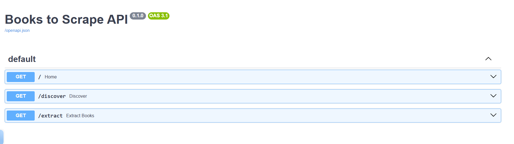
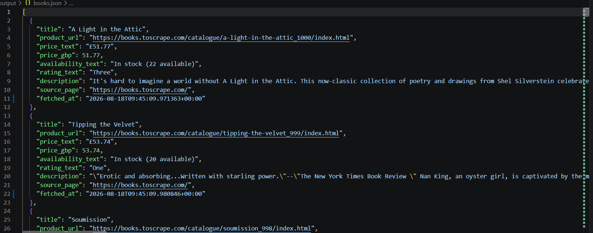
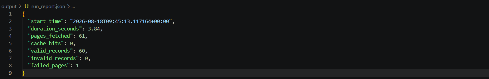

# 📚 Books to Scrape — Async Web Scraper

## 🎯 Project Goal

The goal of this project is to build a scraper that can:

- Discover book URLs from the catalogue
- Fetch book pages asynchronously
- Extract structured book information
- Cache downloaded pages
- Handle individual page failures without stopping the entire run
- Validate extracted records
- Store invalid records separately
- Report failed pages
- Generate a run report containing useful execution statistics

The scraper is designed to be polite to the target website by using a
custom User-Agent, request delays, timeouts, and local caching.

---

The project focuses on building a scraper that is:

- ⚡ Asynchronous
- 🛡️ Failure-tolerant
- 💾 Cache-aware
- ✅ Validation-based
- 📊 Observable through run reports
- 🤝 Polite to the target website

---

## 🛠️ Tech Stack

- Python 3.12+
- FastAPI
- Uvicorn
- httpx
- BeautifulSoup
- Pydantic
- JSON
- AsyncIO

---

## 📸 Project Preview

### Swagger API



### Successful Extraction



### Failure Handling



> Screenshots demonstrate the API, successful extraction, and the
> intentionally failed page used to verify error handling.

---

Expected behaviour:

```text
Catalogue
    ↓
Discover book URLs
    ↓
Fetch pages asynchronously
    ↓
Extract records
    ↓
Validate records
    ↓
 ┌───────────────┐
 │               │
Valid          Invalid
 │               │
 ↓               ↓
books.json    errors.json

Failed requests
       ↓
failed_pages.json

Entire run
       ↓
run-report.json